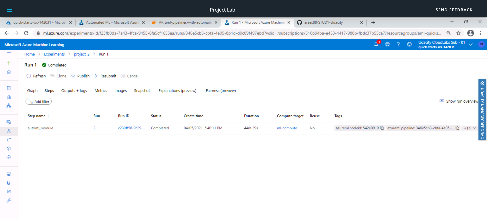

# Operationalizing Machine Learning

This project uses **Microsoft Azure Machine Learning** to configure, deploy and consume a cloud-based machine learning production model.
The project will also include the creation, publishing and consuming of a machine learning pipeline.

Both the **Azure ML Studio** and the **Python SDK** are used in the project. 

### Dataset

The data used for the project is the **Bank Marketing** dataset. 
The model built as part of this project will use the data to predict if a person will subscribe to the long-term deposit with the bank or not.

The dataset used for the project contains almost 33 thousand of records with 20 features.
The snapshot of the dataset is below: 

## **Architectural Diagram**
*TODO*: Provide an architectual diagram of the project and give an introduction of each step. An architectural diagram is an image that helps visualize the flow of operations from start to finish. In this case, it has to be related to the completed project, with its various stages that are critical to the overall flow. For example, one stage for managing models could be "using Automated ML to determine the best model". 

Below is the architectual diagram of the project showing the flow of operations from start to finish.

The project starts with authentication and then we run an Automated ML experiment to deploy the best model.
Next, we will enable Application Insight to review important information about the service when consuming the model.
And finally, we will create, publish, and interact with a pipeline. 

Once all the steps are completed, a short screencast will be created to document all the steps performed.

## **Key Steps**
*TODO*: Write a short discription of the key steps. Remeber to include all the screenshots required to demonstrate key steps. 

The following steps will be performed as part of the project:

1.  Authentication
2.  Automated ML Experiment
3.  Deploy the best model
4.  Enable logging
5.  Swagger Documentation
6.  Consume model endpoints
7.  Create and publish a pipeline
8.  Documentation

Please note, I am using the lab provided by Udacity and hence the authentication has already been performed on my behalf as I am not authorized to create a security principal.

## **I. Create a new AutoML run**

- **“Registered Datasets” in ML Studio shows "Bankmarketing" dataset available**

    

    

- **The experiment is shown as completed**

    
    
    
    
- **Best model**
    
    
    
    
    

## **II. Deploy a model and consume a model endpoint via an HTTP API**

- **Deploy the best model**

    
    
    
    
    
    
    
    
    

- **Endpoints section in Azure ML Studio, showing that “Application Insights enabled” says “true”**

    
    
    

- **Logging is enabled by running the provided logs.py script**

    
    
    

- **Swagger runs on localhost showing the HTTP API methods and responses for the model**

    
    
    
    
    
    
    
    
    

- **The endpoint.py script runs against the API producing JSON output from the model**

    
    
    

- **Apache Benchmark (ab) runs against the HTTP API using authentication keys to retrieve performance results. (optional)**

    
    
    
    
    
    
    

## **III. Create and publish a pipeline**

- **The pipeline section of Azure ML studio, showing that the pipeline has been created**

    
    
- **The Bankmarketing dataset with the AutoML module**

    

- T**he “Published Pipeline overview”, showing a REST endpoint and a status of ACTIVE**

    

## **IV. Configure a pipeline with the Python SDK**

- **A screenshot of the Jupyter Notebook is included in the submission showing the “Use RunDetails Widget” with the step runs**

    

## **V. Use a REST endpoint to interact with a Pipeline**

- **ML studio showing the pipeline endpoint as Active**

    

- **ML studio showing the scheduled run**

    
    
    

## **Screen Recording**

This section includes the link to the project screencast. 
The screencast shows the entire process of the working ML application, including a demonstration of:

- Working deployed ML model endpoint.
- Deployed Pipeline
- Available AutoML Model
- Successful API requests to the endpoint with a JSON payload

Video is available at the following link:  https://www.youtube.com/watch?v=aglqDK0D_nA

## **Standout Suggestions**
*TODO (Optional):* This is where you can provide information about any standout suggestions that you have attempted.

